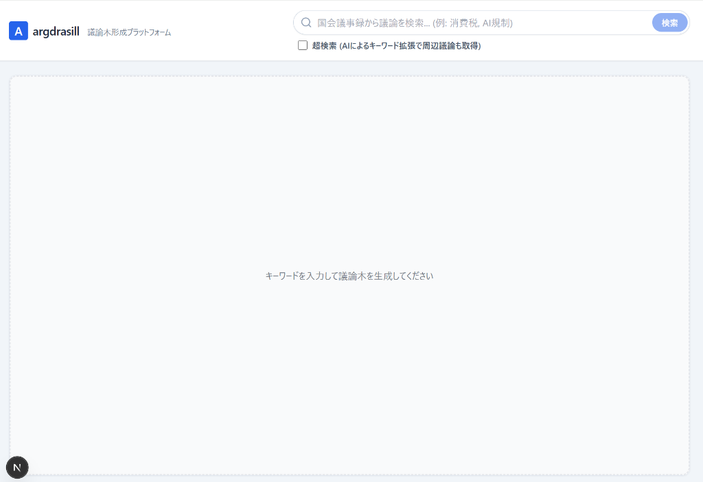
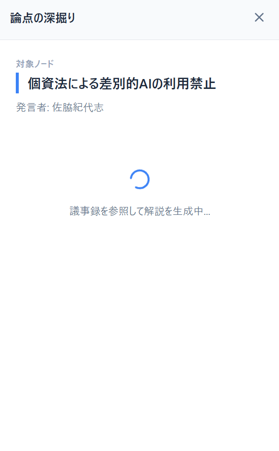
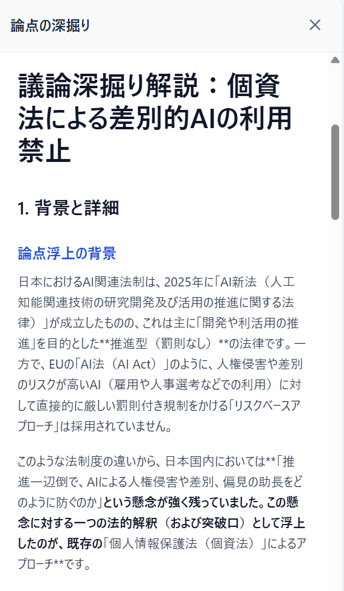

# 国会議論木 - 国会議事録 議論木形成プラットフォーム


**国会議論木** は、国会議事録の膨大なテキストデータをAI（Gemini 3.5 Flash）を用いて瞬時に構造化し、「議論木（Argument Tree）」として可視化するWebアプリケーションです。

「特定のキーワードに対して、どのような賛成・反対・解決策が議論されているのか」を視覚的に把握できるほか、各論点の実際の議事録ソース（一次情報）へのアクセスと深掘り解説を可能にします。

## 📖 使い方 (Usage Flow)

### 1. 初期画面と検索
キーワード（例：「AI規制」）を入力して検索ボタンを押します。「超検索」にチェックを入れると、AIがキーワードを拡張し、多角的な視点から議事録を取得します。


### 2. 議論の全体像を把握
数万文字に及ぶ議事録が解析され、瞬時に「議論木（ツリー）」として視覚化されます。緑枠は賛成や推進、赤枠は反対や懸念事項を示します。


### 3. 論点の深掘り
気になるノードをクリックすると、右側にサイドバーが展開されます。「AIで深掘り解説を生成」ボタンを押すと、国会での実際の議論背景をAIが解説します。


### 4. 背景と詳細の解説
なぜその論点が浮上したのか、法律や社会背景を交えて詳細に解説されます。


### 5. 一次情報へのアクセス
解説の中には、**実際の発言者の引用**と、その発言が記録されている国会議事録の**一次情報URL**が必ず提示されます。これにより確実なファクトチェックと学習が可能です。


## ✨ 主な機能 (Features)

1. **議論の可視化 (Argument Tree)**
   - 国会図書館APIから取得した生の議事録データをAIが解析し、「大テーマ」「賛成」「反対」「補足」「解決策」のノードに分類してツリー構造で描画します。
2. **AIによる論点の深掘り (RAG実装)**
   - ツリー上のノードをクリックすると、その論点に関する「背景・文脈」「関連する実際の発言（一次情報URL付き）」「対立意見や課題」をGeminiが議事録データを参照（RAG）して解説レポートとして生成します。
3. **超検索 (Query Expansion)**
   - 単一のキーワード検索だけでなく、AIが検索意図を汲み取って関連キーワードを複数生成し、並列で国会APIからデータを収集。一問一答の枠を超えた「周辺議論」も網羅的に抽出できます。

## 🛠 技術スタック (Tech Stack)

### Frontend
- **Framework**: Next.js (App Router), React
- **Styling**: Tailwind CSS
- **Visualization**: React Flow (xyflow)
- **Data Fetching**: Axios

### Backend
- **Framework**: FastAPI (Python)
- **AI Model**: Google Gemini 3.5 Flash
- **External API**: 国立国会図書館 国会会議録検索API
- **Architecture**: Retrieval-Augmented Generation (RAG) による動的プロンプティング

## 🚀 ローカルでのセットアップ (Getting Started)

### 前提条件
- Node.js (v18+)
- Python (v3.10+)
- Gemini API Key

### バックエンドの起動
```bash
cd backend
python -m venv venv
# Windowsの場合
.\venv\Scripts\activate
# Mac/Linuxの場合
# source venv/bin/activate

pip install -r requirements.txt

# .envファイルを作成し、GEMINI_API_KEYを設定してください
# 例: GEMINI_API_KEY="your_api_key_here"

uvicorn app.main:app --reload
```

### フロントエンドの起動
```bash
cd frontend
npm install
npm run dev
```

ブラウザで `http://localhost:3000` にアクセスしてください。

## 📄 開発レポート (Documentation)

本プロジェクトの開発における技術的な意思決定や、試行錯誤の過程については以下のドキュメントにまとめています。

- [開発の軌跡と試行錯誤 (Development Journey)](./docs/development_journey.md)
- [技術的アーキテクチャと論点 (Technical Decisions)](./docs/technical_decisions.md)

