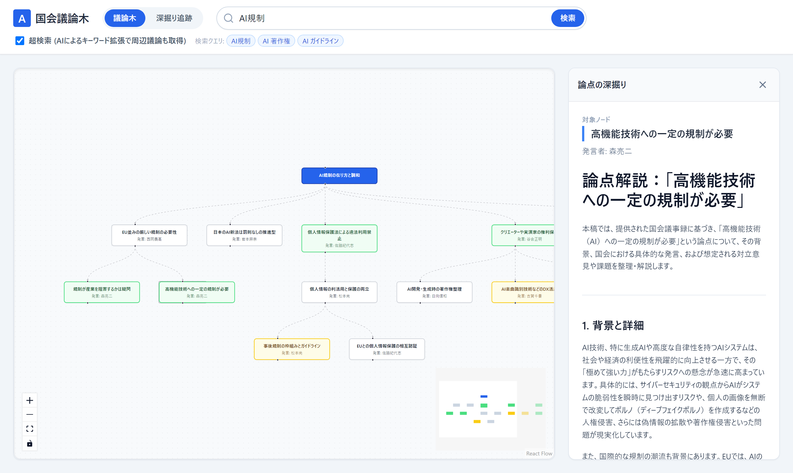
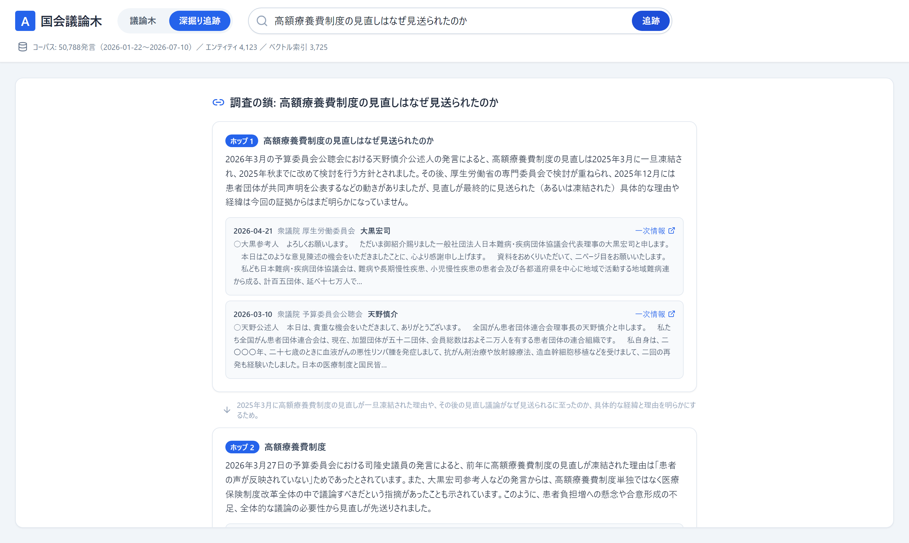
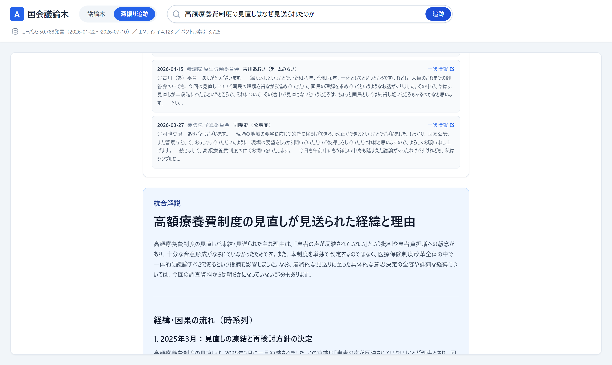

# 国会議論木 — 国会議事録を「構造化」して「手繰る」プラットフォーム

国会議事録の膨大なテキストを、AI（Gemini）で**構造化して見せる**／**過去に遡って手繰る**ためのWebアプリケーションです。


## 何ができるのか

国会議事録は公開されていますが、「賛否がどう分かれているのか」「なぜそうなったのか」を掴むのは困難です。本アプリは、その2つの問いにそれぞれ別のモードで答えます。

| モード | 答える問い | 仕組み |
| --- | --- | --- |
| **議論木** | 「この論点で誰が何を主張しているのか」 | 国会APIからライブ取得 → Geminiが賛成／反対／解決策に構造化 → ツリー描画 |
| **深掘り追跡** | 「なぜそうなったのか」 | ローカルのコーパスDBを**マルチホップ検索**し、過去の事象を1つずつ遡る |

いずれのモードでも、各論点・各発見には国会議事録の**一次情報URL**が付き、ファクトチェックできます。

---

## 1. 議論木モード

キーワードに対して、「大テーマ」「賛成」「反対」「補足」「解決策」のノードを持つ議論木を生成します。ノードをクリックすると、AIが議事録を参照して背景・引用・対立意見を深掘り解説します。



**超検索（Query Expansion）** を有効にすると、AIが検索意図から関連キーワードを複数生成して並列取得します。国会APIの「AND検索のみ」という制約を超えて周辺議論まで拾えます（使用した拡張クエリはUIに表示されます）。

## 2. 深掘り追跡モード（マルチホップ検索）

**このアプリの中核機能です。**

「なぜ高額療養費制度の見直しが見送られたのか」のような問いは、直近の審議 → 数か月前の凍結 → その理由となった患者団体の声…と、**関連事象を1つずつ遡る多段の探索**が必要です。単発のベクトル検索やキーワード検索では、深部（2ホップ目以降）に届きません。

そこで、各ホップでLLMが「分かったこと」と「次に遡るべき焦点」を判断しながら探索を繰り返す、エージェント型の検索を実装しました。結果は「調査の鎖」として、ホップごとの発見と根拠発言（一次情報リンク付き）で表示されます。



最後に、鎖全体を統合した解説が時系列で提示されます。



### なぜハイブリッド検索なのか

各ホップの証拠取得は、性質の異なる3チャネルを**優先順に枠を割り当てて**統合しています。

| チャネル | 役割 | 強み |
| --- | --- | --- |
| **知識グラフ**（エンティティ言及） | 法案・法律・事件・制度の明示参照を辿る | 別時期・別文脈の議論へ**ジャンプ**できる（縦の深さ） |
| **全文検索**（SQLite FTS5 trigram） | キーワードの厳密一致 | 固有名詞に強い。BM25で関連度順 |
| **ベクトル検索**（Gemini Embedding） | 意味的な近さ | 言い換え・言い回しの揺れに強い |

> **実装上の教訓**: 当初は3チャネルの結果を日付降順でマージしていましたが、たまたま新しいだけの無関係な発言が上位を占め、精度が出ませんでした。チャネルごとに採用枠を割り当てる方式に変更して解決しています。詳細は[プロジェクトレポート](./ARTIFACTS/project_report.html)を参照してください。

---

## アーキテクチャ

```
【ライブ系（議論木モード）】
検索キーワード → (超検索: クエリ拡張) → 国会会議録検索API（並列） → Gemini構造化出力 → React Flowツリー

【コーパス系（深掘り追跡モード）】
[オフライン]  ingest         日付範囲の全発言を取得       → SQLite（speeches + FTS5）
              build_graph    法案・事件等の明示参照を抽出  → entities / mentions
              build_embeddings  Gemini Embedding         → ベクトル索引

[オンライン]  問い → [グラフ + FTS + ベクトル] → LLMがホップ判断 → …繰り返し… → 調査の鎖 + 統合解説
```

## 技術スタック

**Frontend** — Next.js (App Router) / React / Tailwind CSS / React Flow (@xyflow/react) + dagre（自動レイアウト）/ axios / react-markdown

**Backend** — FastAPI (Python 3.10+) / [google-genai SDK](https://googleapis.github.io/python-genai/)（構造化出力 `response_schema`・非同期対応）/ Gemini（生成: `gemini-3.5-flash`、埋め込み: `gemini-embedding-001`）/ SQLite（WAL + FTS5 trigram）+ NumPy（コサイン類似検索）/ httpx（国会APIの非同期・並列取得）

---

## セットアップ

### 前提条件
Node.js (v18+) / Python (v3.10+) / Gemini API Key

### 1. バックエンドの起動

```bash
cd backend
python -m venv venv
.\venv\Scripts\activate      # Windows
# source venv/bin/activate   # Mac/Linux

pip install -r requirements.txt

# .env を作成し、GEMINI_API_KEY を設定
# GEMINI_API_KEY="your_api_key_here"

uvicorn app.main:app --reload
```

**議論木モードはこれだけで動きます。**

### 2. コーパスの構築（深掘り追跡モードに必要）

```bash
cd backend  # venv有効化済みの状態で

# ① 発言コーパスの取り込み（中断しても再実行で続きから）
python -m app.ingest --from 2026-01-01 --until 2026-07-16

# ② 知識グラフの構築（ルールベース。LLM不要・無コストで何度でも再実行可）
python -m app.build_graph

# ③ ベクトル索引の構築（新しい発言から順。まず直近分だけでも動作する）
python -m app.build_embeddings --limit 3000
```

取り込み範囲を過去に広げるほど、深掘り追跡が遡れる範囲も広がります。`build_embeddings` は未処理分だけを埋め込むインクリメンタル設計です。

> **埋め込みのコストに注意**: Gemini Developer APIの無料枠は `embed_content` が **1日100リクエスト**までのため、大量構築は途中で止まります。`.env` に以下を設定すると、ADC認証のVertex AI経由（プロジェクト課金・日次上限なし）に切り替わります。
>
> ```
> EMBEDDING_USE_VERTEX=true
> GCP_PROJECT=your-gcp-project-id
> GCP_LOCATION=us-central1
> ```
>
> 事前に `gcloud auth application-default login` と Vertex AI APIの有効化が必要です。**従量課金が発生します。**

なお、ベクトル索引が未構築でも深掘り追跡は動作します（グラフ＋全文検索チャネルにフォールバックします）。

### 3. フロントエンドの起動

```bash
cd frontend
npm install
# 必要なら .env.local で NEXT_PUBLIC_API_URL を設定（既定: http://localhost:8000）
npm run dev
```

ブラウザで `http://localhost:3000` を開いてください。

---

## APIエンドポイント

| メソッド | パス | 用途 |
| --- | --- | --- |
| `POST` | `/api/search` | 議論木の生成（ライブ取得） |
| `POST` | `/api/node_detail` | ノードの深掘り解説 |
| `POST` | `/api/deep_search` | マルチホップ検索（調査の鎖） |
| `GET` | `/api/corpus_status` | コーパスの構築状況 |

## ドキュメント

- [プロジェクトレポート（SPA型・論点管理）](./ARTIFACTS/project_report.html) — 設計判断・論点・実装計画の中核ドキュメント
- [開発の軌跡と試行錯誤](./docs/development_journey.md)
- [技術的アーキテクチャと論点](./docs/technical_decisions.md)
