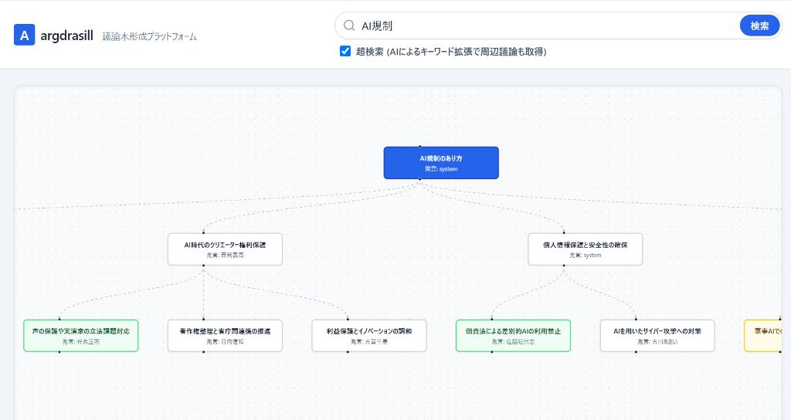

# 国会議論木 - 国会議事録 議論木形成プラットフォーム



**国会議論木** は、国会議事録の膨大なテキストデータをAI（Gemini）で構造化・探索するWebアプリケーションです。2つのモードを備えています。

1. **議論木モード** — キーワードに対する賛成・反対・解決策の構造を「議論木（Argument Tree）」として即時に可視化
2. **深掘り追跡モード** — 「なぜ〜になったのか」という問いに対し、コーパスDB上で**過去の関連事象を1つずつ手繰る（マルチホップ検索）**ことで、時系列・因果の鎖を辿った調査結果を提示

いずれも、各論点・各発見には国会議事録の**一次情報URL**が付き、ファクトチェック可能です。

## ✨ 主な機能 (Features)

### 1. 議論の可視化 (Argument Tree)
国会会議録検索APIからライブ取得した議事録をAIが解析し、「大テーマ」「賛成」「反対」「補足」「解決策」のノードに分類してツリー描画します。ノードをクリックすると、背景・引用・対立意見の深掘り解説（一次情報URL付き）を生成できます。

### 2. 超検索 (Query Expansion)
AIが検索意図を汲み取って関連キーワードを複数生成し、並列で議事録を収集。国会APIの「AND検索のみ」という制約を超えて周辺議論を網羅します。使用した拡張クエリはUIに表示されます。

### 3. 深掘り追跡 (Multi-hop Search / ハイブリッドGraphRAG)
「なぜ政治資金規正法が改正されたのか」のような問いは、直近の審議 → 数年前の事件 → さらに前の法改正…と**関連事象を遡る多段の探索**が必要で、単発のベクトル検索やキーワード検索では届きません。本アプリは次の三層で解決します。

- **全文検索（SQLite FTS5）＋ ベクトル検索（Gemini Embedding）** — 各ホップの証拠取得（入口の発見）
- **知識グラフ（エンティティ言及）** — 発言から抽出した法案・法律・事件・制度のエンティティを辿って、別時期・別文脈の議論へジャンプ
- **エージェント型トラバーサル（Gemini）** — 各ホップで「分かったこと」と「次に遡るべき焦点」を判断し、調査の鎖を構成

結果は「ホップごとの発見＋根拠発言（一次情報URL付き）＋統合解説」として表示されます。

## 🏗 アーキテクチャ

```
【ライブ系（議論木モード）】
検索キーワード → (超検索: クエリ拡張) → 国会会議録検索API（並列） → Gemini構造化出力 → React Flowツリー

【コーパス系（深掘り追跡モード）】
[オフライン]  ingest（日付範囲の全発言取得） → SQLite（speeches + FTS5）
              build_graph（法案・事件等の明示参照抽出） → entities / mentions
              build_embeddings（Gemini Embedding） → ベクトル索引
[オンライン]  問い → [FTS + ベクトル + グラフ近傍] → LLMがホップ判断 → …（繰り返し）→ 調査の鎖 + 統合解説
```

## 🛠 技術スタック (Tech Stack)

### Frontend
- Next.js (App Router) / React / Tailwind CSS
- React Flow (@xyflow/react) + dagre — 議論木の自動レイアウト
- axios / react-markdown

### Backend
- FastAPI (Python 3.10+)
- **google-genai SDK**（構造化出力 response_schema / 非同期対応）
- Gemini（生成: `gemini-3.5-flash` / 埋め込み: `gemini-embedding-001`）
- SQLite（WAL + FTS5 trigram 全文検索）+ NumPy（コサイン類似検索）
- httpx（国会会議録検索APIの非同期・並列取得）

## 🚀 ローカルでのセットアップ (Getting Started)

### 前提条件
- Node.js (v18+) / Python (v3.10+) / Gemini API Key

### 1. バックエンドの起動
```bash
cd backend
python -m venv venv
.\venv\Scripts\activate      # Windows
# source venv/bin/activate   # Mac/Linux

pip install -r requirements.txt

# .envファイルを作成し、GEMINI_API_KEYを設定
# 例: GEMINI_API_KEY="your_api_key_here"

uvicorn app.main:app --reload
```

議論木モードはこれだけで動作します。

### 2. コーパスの構築（深掘り追跡モードに必要）
```bash
cd backend  # venv有効化済みの状態で

# ① 発言コーパスの取り込み（日付範囲は自由。中断しても再実行で続きから）
python -m app.ingest --from 2026-01-01 --until 2026-07-16

# ② 知識グラフの構築（LLM不要・何度でも無コストで再実行可）
python -m app.build_graph

# ③ ベクトル索引の構築（新しい発言から順。まず直近分だけでも動作する）
python -m app.build_embeddings --limit 3000
```

> 取り込み範囲を過去に広げるほど、深掘り追跡が遡れる範囲が広がります。
> `build_embeddings` は未処理分だけを埋め込むインクリメンタル設計です（件数×APIコストに注意）。

### 3. フロントエンドの起動
```bash
cd frontend
npm install
# 必要なら .env.local で NEXT_PUBLIC_API_URL を設定（既定: http://localhost:8000）
npm run dev
```

ブラウザで `http://localhost:3000` にアクセスしてください。

## 📄 開発レポート (Documentation)

- [プロジェクトレポート（SPA型・論点管理）](./ARTIFACTS/project_report.html) — 設計判断・論点・実装計画の中核ドキュメント
- [開発の軌跡と試行錯誤 (Development Journey)](./docs/development_journey.md)
- [技術的アーキテクチャと論点 (Technical Decisions)](./docs/technical_decisions.md)
